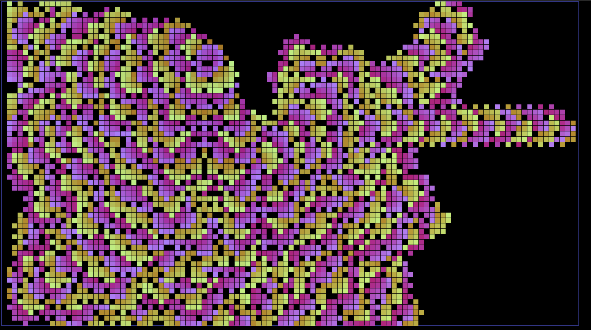
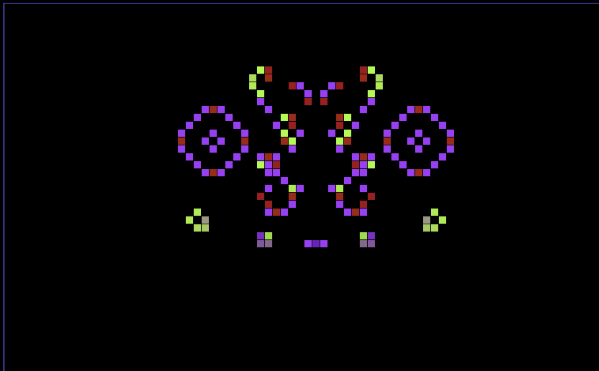

# Welcome to our Experiment!
We've implemented Jon Conway's game of life and then had fun trying to change the rules of the game. You can experiment by seeding the game with seeds that may form stationary shapes, create cool movement, for fill the board with patterns. Get started by clicking 2+ pixels on the board.  

# Motivation
This project was completed during UGA Hacks 6. At the beginning of the project, we started brainstorming something that would be fun, low-stress, and somehow combine a little math and pixel art. The Game of Life was super fun to code, not just because it allowed us to practice our underdeveloped web skills, but because researching the topic is so interesting! We enjoyed watching [Dylan Beattie's explanation of the game and why it matters](https://www.youtube.com/watch?v=6avJHaC3C2U), and learning more about the idea of [Emergence](https://en.wikipedia.org/wiki/Emergence). We barely scratched the surface of this topic over the weekend.

[Emergence in Generative Art](https://www.artnome.com/news/2020/7/12/the-game-of-life-emergence-in-generative-art)

### Acknowledgements and Resources
Inspired by the work of [Jon Conway](https://www.theguardian.com/science/2015/jul/23/john-horton-conway-the-most-charismatic-mathematician-in-the-world)

Some of our code was adapted from work by Daniel Shiffman:
[Coding Tutorial](https://www.youtube.com/watch?v=FWSR_7kZuYg&vl=en)  
[Coding Example](https://github.com/CodingTrain/website/tree/main/CodingChallenges/CC_085_The_Game_of_Life/P5).  
   
[Blog Inspiration](https://www.freecodecamp.org/news/how-to-create-generative-art-in-less-than-100-lines-of-code-d37f379859f/)  
[Links to Generative Art](http://blog.hvidtfeldts.net/index.php/generative-art-links/)

[HTML Tools](https://www.w3schools.com/html/html_scripts.asp)

